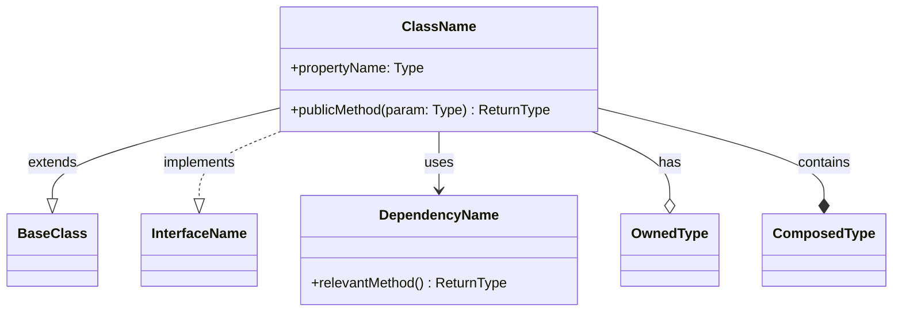
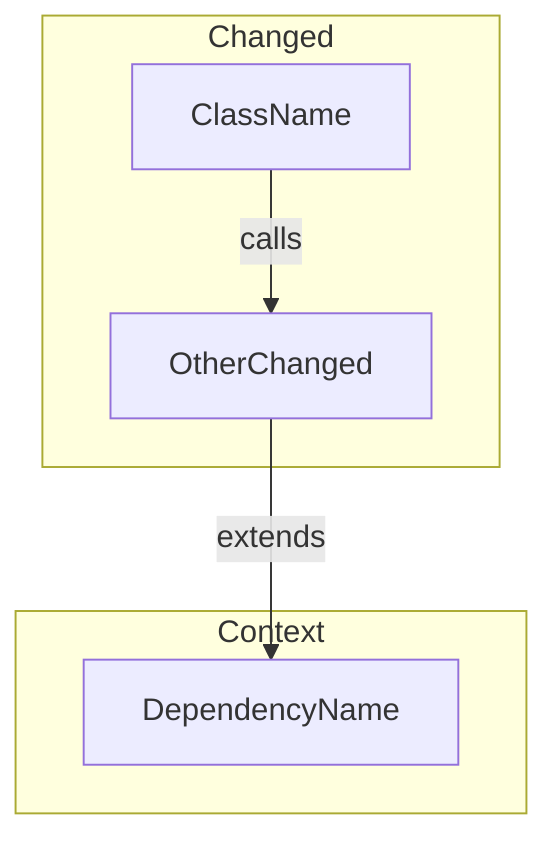

# Draw Graph of Branch Changes

Generate a Mermaid diagram of classes (and related types) that changed on the current git branch compared to its base, plus their immediate dependencies.

## Workflow

Copy this checklist and track progress:

```
Task Progress:
- [ ] Step 1: Identify the base branch and changed files
- [ ] Step 2: Extract changed classes/interfaces/types
- [ ] Step 3: Identify immediate dependencies of changed classes
- [ ] Step 4: Choose diagram type and render Mermaid
- [ ] Step 5: Write the diagram to a file
```

### Step 1: Identify base branch and changed files

```bash
# Find the merge-base with main (or master)
BASE=$(git merge-base HEAD main 2>/dev/null || git merge-base HEAD master)

# List files changed on this branch
git diff --name-only "$BASE"...HEAD
```

Filter to source files only (e.g. `*.ts`, `*.tsx`, `*.js`, `*.jsx`, `*.py`, `*.cs`, `*.java`, `*.go`). Ignore test files, config, and non-code assets unless they define relevant types.

### Step 2: Extract changed classes/interfaces/types

For each changed source file, read the file and extract:

- **Classes** (including abstract classes)
- **Interfaces / Protocols / Traits**
- **Enums** used as class members or parameters
- **Type aliases** only if they are central to the changed logic

Record for each type:
- Name
- Kind (`class`, `interface`, `enum`, `abstract class`)
- File path
- Key members (public methods and important properties)
- Inheritance (`extends`, `implements`, base classes)

Use `git diff "$BASE"...HEAD -- <file>` to confirm which types actually have meaningful changes (not just whitespace or imports).

### Step 3: Identify immediate dependencies

For each changed class, find types it directly references that were **not** already captured in Step 2. Include a dependency if:

- The changed class extends or implements it
- It appears as a parameter type, return type, or property type in changed methods
- It is instantiated or called in changed code

Read those dependency files and extract the same metadata (name, kind, members, inheritance). Mark these as **context types** (unchanged but relevant).

### Step 4: Choose diagram type and render

**Choose based on the nature of the changes:**

- **Class diagram** — Best when inheritance, interfaces, or structural relationships are the focus.
- **Flowchart** — Best when the changes represent a workflow, pipeline, or call chain.

If unclear, default to **class diagram**.

#### Class Diagram Template

````markdown

````

#### Flowchart Template

````markdown

````

#### Styling conventions

| Element | Treatment |
|---------|-----------|
| Changed class | Include in diagram normally; list in a `%% Changed` comment group |
| Context class (unchanged) | Include in diagram; list in a `%% Context` comment group |
| Relationship labels | Use: `extends`, `implements`, `uses`, `has`, `contains`, `calls` |
| Members | Show only **public** methods/properties relevant to the changes |

Keep the diagram readable:
- Limit to ~15 types max. If more, group by package/module using subgraphs or focus on the most-connected types.
- Use `direction TB` (top-to-bottom) for class diagrams; `TB` or `LR` for flowcharts depending on shape.
- Omit trivial getters/setters and utility methods.

### Step 5: Write the diagram

Write the Mermaid diagram into a markdown file at the repository root:

```
branch-changes-diagram.md
```

Structure:

````markdown
# Branch Changes Diagram

> Auto-generated diagram of classes changed on branch `<branch-name>` vs `<base-branch>`.

## Changed Files

- `path/to/file1.ts`
- `path/to/file2.ts`

## Diagram

```mermaid
<diagram here>
```

## Legend

- **Changed**: Classes directly modified on this branch
- **Context**: Unchanged classes included for relationship clarity
````

After writing, display the diagram content in the chat response so the user can preview it immediately.

## Tips

- If the branch has no class-level changes (e.g., only function edits in non-OOP code), adapt: use **functions as nodes** in a flowchart instead.
- For monorepos, note which package each type belongs to using subgraph grouping.
- If the diff is very large (>30 files changed), ask the user whether to scope to a specific directory or package.